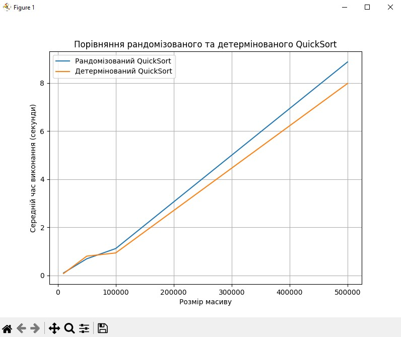
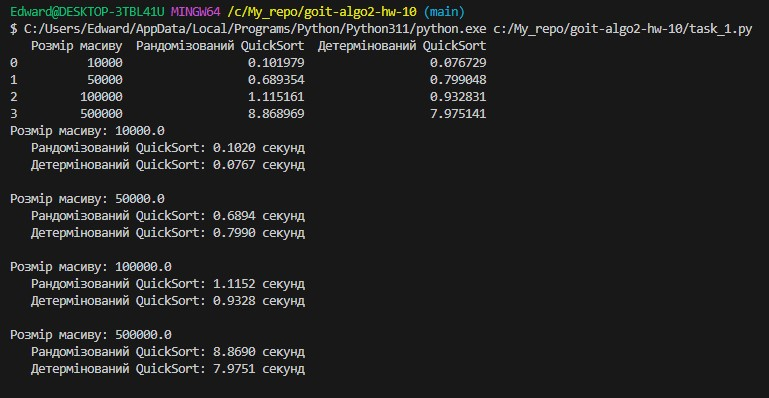
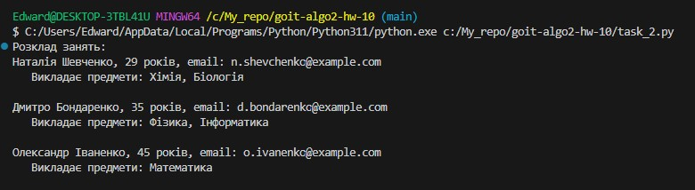

# Домашнє завдання до теми «Алгоритмічна складність, наближені та рандомізовані алгоритми»

## Завдання 1. Порівняння рандомізованого та детермінованого QuickSort

## Завдання 2. Складання розкладу занять за допомогою жадібного алгоритму

